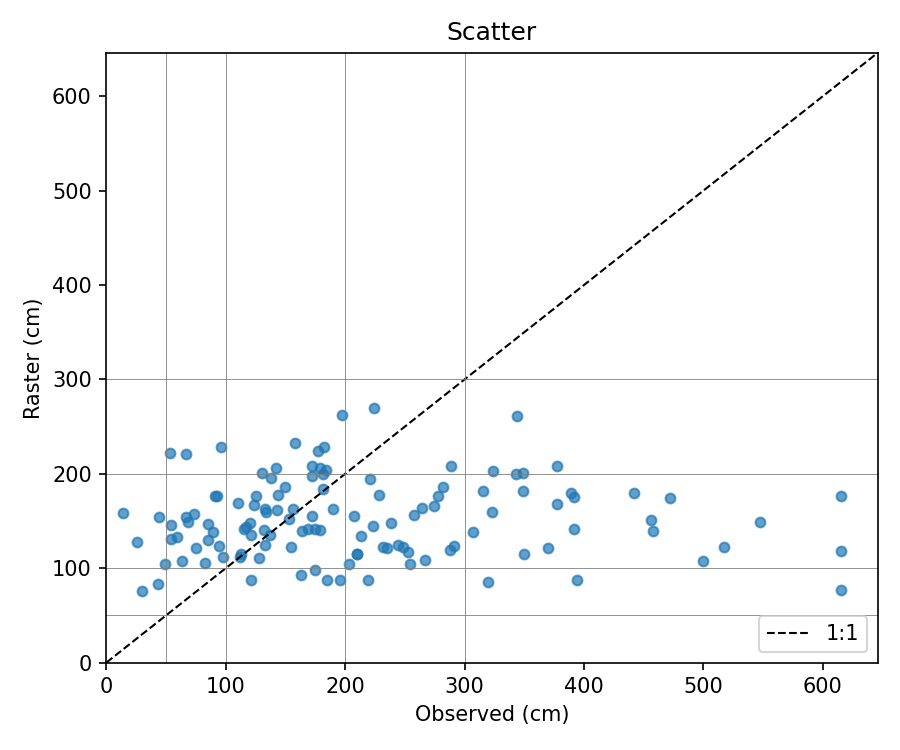
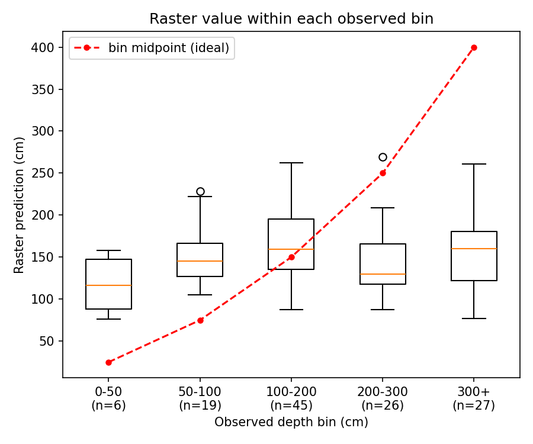
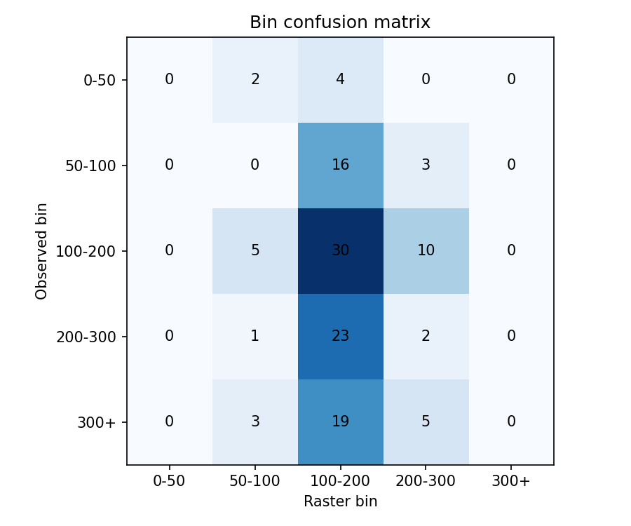

# 10. Validation Analysis
Part II — Field Validation & Ecosystem Carbon (2025 Season)

## Sections to cover
- 10.1 Measured vs modeled — probability, depth, decomposition fraction, carbon stock; error metrics (RMSE, ME/bias, R^2, concordance); performance by stratum (type/region/condition) 
- 10.2 Above:belowground partitioning — field-measured peat-C:tree-C ratio; corroboration of belowground-dominance conclusion 
- 10.3 Bias diagnosis & feedback — where/why the model under-/over-predicts; spatial reliability map; 

## Validation of the Peat Depth Model Against the 2025 Field Data

Modeled peat depth was compared with the field measured depth data from 123 sites. The results are binned into depth buckets for comparison (bias = raster − field, in cm).

| Observed bin (cm) | n | Field mean | Raster mean | Raster range | Bias | MAE | Within ±50 cm |
|---|---|---|---|---|---|---|---|
| 0–50 | 6 | 34 | 117 | 76–158 | +83 | 83 | 33% |
| 50–100 | 19 | 76 | 151 | 105–229 | +75 | 75 | 37% |
| 100–200 | 45 | 152 | 160 | 88–263 | +8 | 35 | 76% |
| 200–300 | 26 | 244 | 145 | 88–270 | −99 | 103 | 8% |
| 300+ | 27 | 417 | 156 | 77–261 | −261 | 261 | 0% |
| **All** | **123** | **212** | **152** | **76–270** | **−60** | **108** | **37%** |

### Bin agreement

The raster and field measurements fall in the same depth bin at 26% of sites. Agreement within one bin is 76%, but this is mainly because the raster predictions cluster in the 100–200cm bin, which is next to two other bins. The Spearman rank correlation between observed and predicted depth is 0.08 (p = 0.40), so there is no evidence that deeper sites receive higher predicted depths.

### Figures

::: {#fig-depb layout-ncol=3}

Field validation of the depth model (n = 123)

- **Scatter plot:** Points sit around the 80–270cm mark across the predicted range and no point reaches the 1:1 line above 270 cm.
- **Boxplot:** The raster median stays at 115–160 cm in every predicted bin. The raster's overall range is 76–270 cm, and sites in the observed 300+ cm bin still receive a median prediction of about 160 cm.
- **Confusion matrix:** Nearly all sites land in the 100–200 cm predicted column. All 27 sites deeper than 300 cm are predicted below 300 cm, and 19 of them fall in the 100–200 cm bin.
